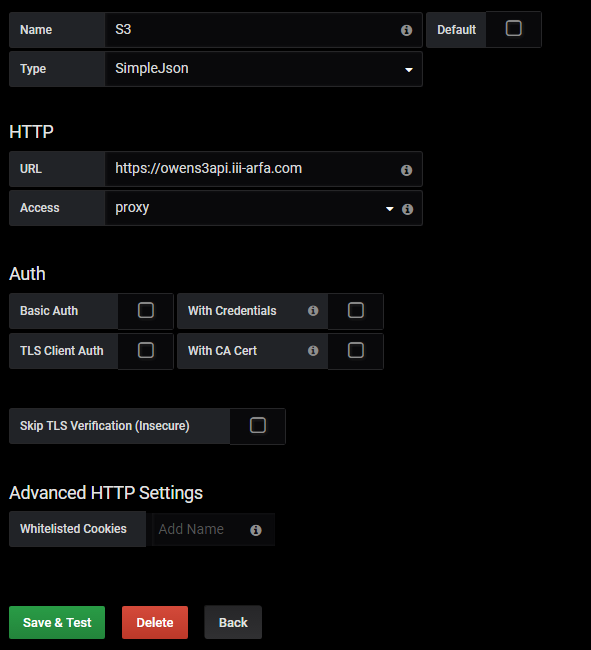
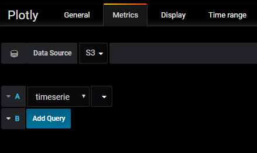
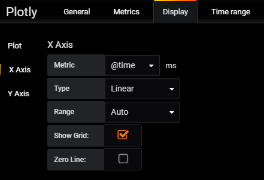
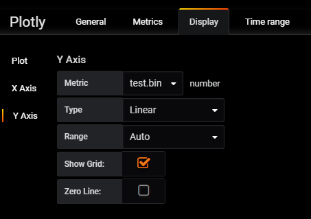
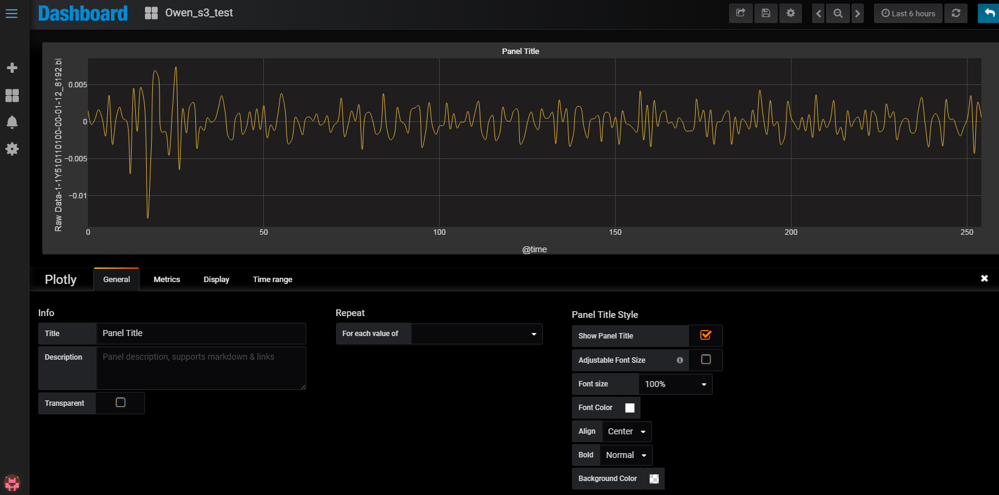

### Request

`POST|GET /`

For Grafana test connection

`POST /query`

Post Body

|Key       | Value                                                                       |
|----------|-----------------------------------------------------------------------------|
|access_key| Key to access blob storage, for example: d6dfc3363d0449a1acde32aa844b8c9e   |
|secret_key| Key to identify user's premission, example: d6dfc3363d0449a1acde32aa844b8c9e|
|host      | address of private blob storage, could be a IP address or domain name       |
|port      | port of private blob storage                                                |
|bucket    | bucket name which stored queue content                                      |
|filename  | file name to be visualized, ex. max.bin, min.bin, mean.bin                  |
|sid       | ID of Smart Machine Box, ex. smartbox11 signal Data                         |
|tag       | ID of tag, ex. 1Y510110100                                                  |
|date      | date, ex. 2018/6/10, 2018/10/6                                              |

Example
`{
    "timezone": "browser",
    "panelId": 2,
    "dashboardId": 56,
    "range": {
        "from": "2019-03-09T01:13:44.138Z",
        "to": "2019-03-09T07:13:44.138Z",
        "raw": {
            "from": "now-6h",
            "to": "now"
        }
    },
    "rangeRaw": {
        "from": "now-6h",
        "to": "now"
    },
    "interval": "15s",
    "intervalMs": 15000,
    "targets": [
        {
            "target": "1Y510110100@Acceleration RMS band 0@min",
            "refId": "A",
            "type": "timeserie"
        }
    ],
    "maxDataPoints": 1260,
    "scopedVars": {
        "__interval": {
            "text": "15s",
            "value": "15s"
        },
        "__interval_ms": {
            "text": 15000,
            "value": 15000
        }
    }
}`

### Configure Grafana

#### Add Datasource

#### Add a Plotly

#### Result

### TODO
1. Execption catch, such as (1) file does not exist in bucket, (2) bucket does not exist, (3) file is empty or cannot read by Pandas
2. Multiple file queue (cross file queue): in this scenario, usually create an index file after file upload, when Grafana require data, we should queue index to identify file name and bucket at the first stage, then queue the file accroding to result
3. Cloud Foundry App-lization, you should create your own manifest file and push it to WISE-PaaS

